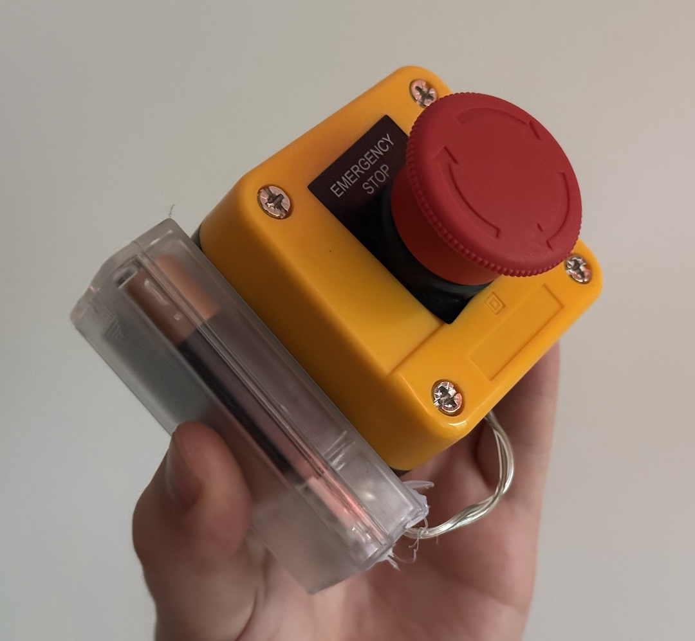
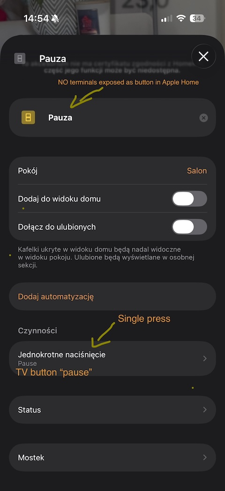
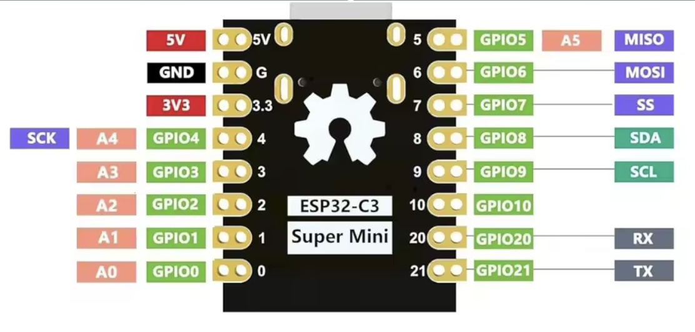
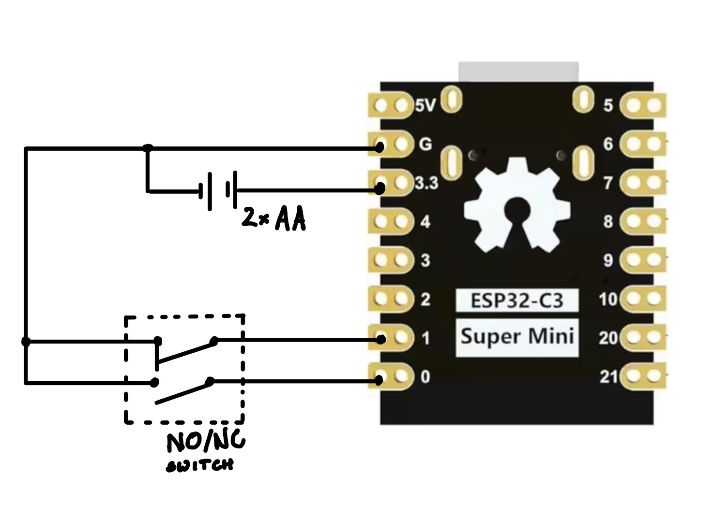

# esp32_ble_button
A battery-powered button made with ESP32-C3 (tutorial included).

I use it as emergency pause during movies.

## Why? Again, what do you use it for?

Me and my wife like to watch and comment movies together. We pause the movies very often to just comment on anything, praising the movie or poiting out the things in the background or inconsistencies.
Or we just compare the themes or the movie to the other media. Or just talk about the plot.

That's why we usually need to pause the movie immediately, so we won't have to go back a few seconds to hear a dialogue again or to find the exact frame we wanted to talk about.

Unfortunately our current problems are
* the TV remote gets lost on the couch,
* we misclick (especially me, fat finger, little pause button),
* we double click and some players just interpret both the Play and Pause as Play/Pause, which resumes the movie.

To fix this issues, I've come up with my little invention - **the emergency stop button**.



I've bought an emergency stop button (NO/NC) for 4 EUR, used an ESP32-C3 super mini and a 2xAA battery box from some non-functioning light string and *voila*!

## How does it work?

The ESP32's GND, GPIO0 and GPIO1 is wired to the NO (normally open) and NC (normally closed) terminals of the emergency stop button. This way, when GPIO0 or GPIO1 is LOW, I wake up the ESP32 and broadcast a BLE advertisement for 1200ms, and then put the ESP32 back to deep sleep.

The batteries should last for some time (maybe a few years) because I don't maintain a constant Bluetooth/WiFi connection. I just fire and hope the message's delivered.

Every time I make a BLE advertisement, I generate a random number that is used during the broadcast to detect retransmissions (and prevent false presses).

The advertisements are detected by a [Homebridge plugin made by me](https://github.com/multicatch/homebridge-ble-adv) and exposed to Apple Home as wireless buttons.

I also use another [Homebridge plugin made by me to expose the TV buttons in Apple Home](https://github.com/multicatch/homebridge-philipstv-2020-ambilight). So it's just a matter of making an automation that just simulates "Play" and "pause" TV buttons when Apple Home is notified about the button press.

And that's how it works. 



The latency is about 400-700ms, but the Mac hosting Homebridge is relatively far from the couch. And the Play/Pause commands are issued to the TV via HTTP.

I think it's a pretty good result given the button is easier to reach, so it's much faster to press and we have a bigger time margin for latency. 

And maybe if I used an IR transmitter wired to the ESP32 then the latency would be even lower, but I wanted to make the button more reliable. The IR transmitters have the disadvantage of only working when you point them in the direction of the receiver. The UX of the device would be worse. And with this setup, you can just mash the button no matter where it is or how it's pointed. Much more satistying to use.

## Demo


# How I did it

## Schematics and code explaination

I used an ESP32-C3 Super Mini



The circuit of the button is really simple, those are the schematics:



**Note**: After testing the firmware, I ~~unsoldered~~ burned the PWR LED with my soldering iron ¯\\_ (ツ)_/¯. It was constantly on, even in deep sleep, so it was just wasting energy.

I used **Arduino IDE** with the espresif's esp32 plugin to develop the firmware (source code located in [`esp32_ble_button`](./esp32_ble_button)).

The way the firmware works: It sets the pinMode of the GPIO0 and GPIO1 to input, so I can detect when they are shorted (that means the switch is latched).

Then I check what button has woken the ESP32 up. The setup method is when the ESP32 is powered up AND when it is woken up. 

After determining what GPIO port caused the wakeup, I just setup a BLE advertisement (with custom **manufacturerData**) and broadcast it for 400ms x3 (that means 1200ms in total, restarting the advertisement 3 times).
I restart the advertisement to make sure it has not hung up.

The **manufacturerData** is used to broadcast the state change - when the button is down, I broadcast `1` (and a nonce), when it's up, I broadcast `2` (and a nonce).

The nonce is used to prevent false presses. It basically works like this: before I start the advertisement, I generate a random number. And then append it to the **manufacturerData**. So the final *manufacturerData* looks like this:

```text
2;960
```

Why the nonce? I basically spam the air with my advertisement, because some of the communication won't reach the receiver. So the receiver will probably get about 5-20 advertisements from the button and I only want to acknowledge ONE real button press.

Then the ESP32 enabled GPIO wakeup on the other GPIO port (the one that is not currently LOW, aka shorted).

**Note**: You may think the GPIO wakeup is only supported with the light sleep but the ESP32-C3 is able to do deep sleep with GPIO wakeup (it lacks EXT1 wakeup though), see [espressif's docs about this](https://docs.espressif.com/projects/esp-idf/en/stable/esp32c3/api-reference/system/sleep_modes.html#gpio-wakeup)

## The Homebridge receiver

Next problem: how to receive the BLE advertisement and how to expose this signal in my smart home?

I've decided to make a Homebridge plugin, because I have some experience with Homebridge and my TV is also added to Apple Home (via a Homebridge plugin). So I wanted to just make an automation in Apple Home and call it a day.

My Homebridge server is hosted on a Mac Mini Server 2011 and despite its age, it supports BLE. I've tested an npm module called [noble](https://www.npmjs.com/package/@abandonware/noble) and *it just worked*.

So I've made a quick plugin (based on another Homebridge plugin made by me), and I've exposed the ESP32 as two smart buttons in Apple Home:


The Homebridge plugin is called [homebridge-ble-adv](https://github.com/multicatch/homebridge-ble-adv) if you're interested. The configuration is really simple, you just need to provide the device name and the **manufacturerData** pattern. When this plugin detects an advertisement that matches those two values, it will send a `single click` event to Apple Home.


Of course, you need to have your TV exposed as a smart device in Apple Home. If you have a Philips TV, you can also use my other plugin called [homebridge-philipstv-2020-ambilight](https://github.com/multicatch/homebridge-philipstv-2020-ambilight).

## Afterthoughts

I'm satisfied with the effect, the latency is actually not that bad. I believe I could also cut it down if I made a dedicated BLE receiver/IR transmitter (that would be powered by USB). 

Because currently it works like this:

```text
Emergency stop button advertisement -> Mac Mini (Homebridge) -> Apple Home -> Mac Mini (Homebridge) -> TV (via HTTP API) 
```

And it could work like this:

```text
Emergency stop button adv -> ESP32 receiver (with IR) -> TV (via IR)
```

But it would look ugly (unless I'd 3D printed some nice casing) and I don't have actually the space for another cable. So it is what it is.

I've also tried using my SwitchBot Hub 2 in my automation - this Hub has IR and I can expose the IR device via Matter. This means I was able to have "Play" and "Pause" buttons exposed as a switch in Apple Home.

Setting it in the ON position triggered the Hub 2 to send an IR signal for "Play", and OFF worked as IR signal for "Pause". But it was sloooow. The latency was so high. The Hub 2 needed a second to actually send the signal after getting the "set switch to ON/OFF" event. So I went back to using the HTTP API of my TV.
